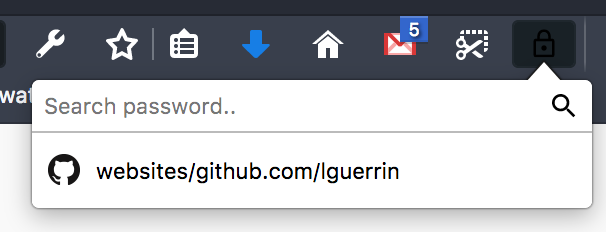

# BrowserGopass

It's a browser plugin to populate login from from credentials stored via gopass



## Installation

* Download the last release, and unarchive it where you want
* Execute the install.sh (sudo on Linux)

The native app is installed. Next you need intall the plugins

### Chrome

Drag and dropthe XPI file to the extension page  

### Chrome

Drag and dropthe CRX file to the extension page

## How build and test

You need to install:
 * gopass
 * go
 * npm
 
 And run:
 ```bash
npm install -g browserify  
 ```
 
 and next you can download sources and run:
```bash
npm install
make build install
```

The phase build will compile go source code and JS.
Next *install* will copy plugin to chrome and firefox browser.

Next, you can load add-on from folder *build* and debug it from browser.

For chrome, you have to update extension ID in host.json after install and execute a second *make build install*

